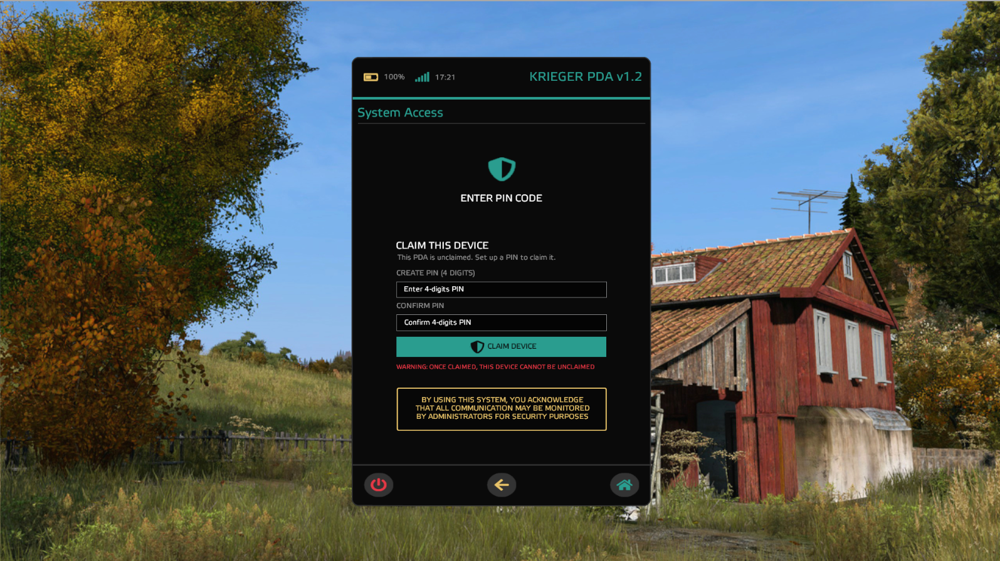
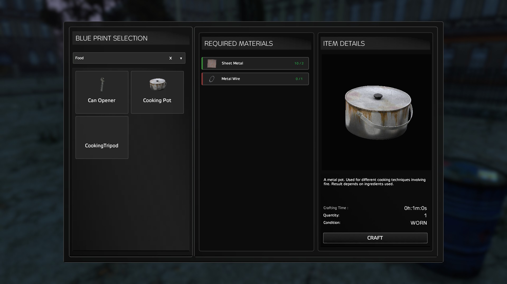

# Hi there, I'm Dmitri 👋

## About Me

Full Stack Developer and Freelancer in game development with a passion for creating innovative solutions. I enjoy tackling complex problems and coming up with out-of-the-box solutions.

### My Motto

> "Beyond the box lies the solution."

### Skills

#### Programming Languages

#### Web Technologies

#### Frameworks & Tools

#### Databases

#### ORMs

## GitHub Stats

## My Projects

* [TraderPlusV1](https://github.com/TheDmitri/TraderPlusV1) - 1 Million+ users on Steam
* [TraderPlusEditor](https://github.com/TheDmitri/traderpluseditor) - Lead/Architect for the upcoming V2 of TraderPlus

## Steam Mods

* [TraderPlus](https://steamcommunity.com/sharedfiles/filedetails/?id=2458896948)
* [ToxicZone](https://steamcommunity.com/sharedfiles/filedetails/?id=1752669393)
* [RadZone](https://steamcommunity.com/sharedfiles/filedetails/?id=2382269420)

## COMMISSIONS WORK
Last commission was a PDA System and a Workbench for a client.
### PDA System
* 
### Workbench
* 

## Connect With Me

## Profile Views

